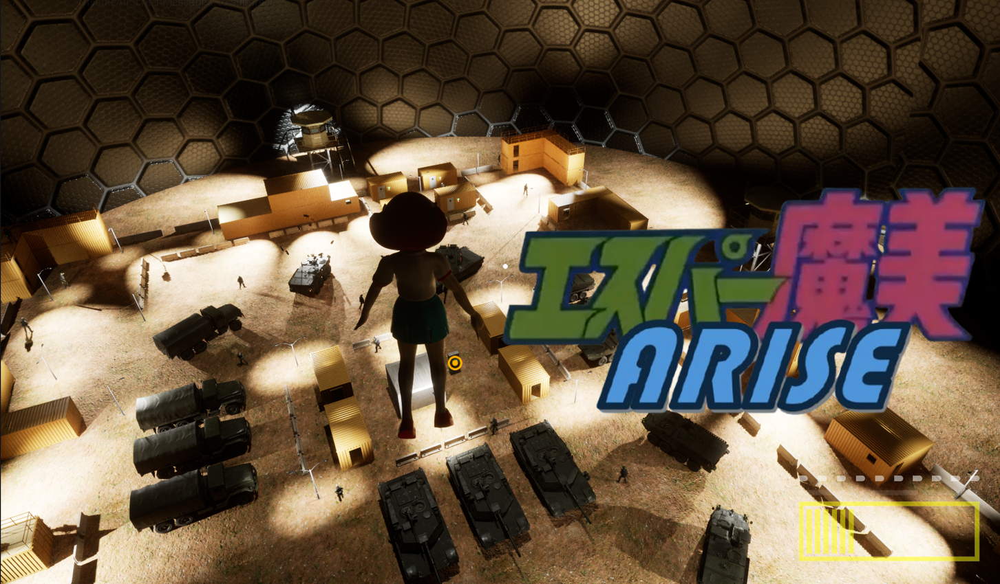

# Esper Mami: Arise

An action adventure game featuring psychic powers and photorealistic graphics. A homage to anime series Esper Mami (1987-1989), and its creator, Fujiko · F · Fujio.

Download from Google drive: [stable](https://drive.google.com/file/d/1-_Da3w-AWYP6kxPA4HReAPU8yTtxwTM2/view?usp=drive_link) or [preview (for latest features)](https://drive.google.com/file/d/1Qj3-oLRMno7tHeRhWqJqOAI-iVfVRhI4/view?usp=drive_link). Or access the [itch.io page](https://trentfellbootman.itch.io/esper-mami-arise).
